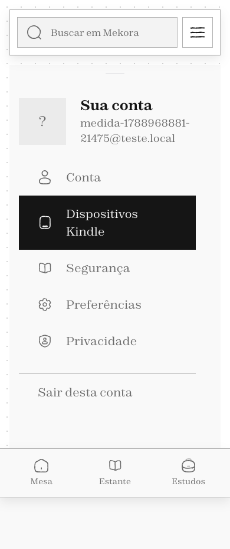

# Mekora

O **Mekora** é uma aplicação web para transformar documentos em uma experiência de leitura organizada. O sistema recebe arquivos, converte o conteúdo para formatos adequados, organiza uma biblioteca pessoal e conecta leitura, notas, estudos e relações visuais em um Canvas.

Este repositório registra o estado funcional do projeto em **10 de setembro de 2026** e foi preparado como entrega acadêmica executável.

## Principais recursos

- envio e preparação de documentos;
- conversão para EPUB e processamento local com OCR;
- biblioteca pessoal em grade ou estante 3D;
- leitor responsivo com progresso, destaques e notas;
- Mesa para acompanhar arquivos em processamento;
- organização de notas e estudos;
- Canvas visual com notas, livros, seções e conexões;
- integração com dispositivos Kindle;
- autenticação por link enviado por e-mail;
- temas claro e escuro e interface adaptada para celular;
- armazenamento local e API protegida por sessão.

## Interface

### Leitor em desktop


### Leitor em celular



Outras capturas de navegação estão em [`docs/imagens`](docs/imagens).

## Tecnologias

- **Frontend:** React 19, Vite e React Router;
- **Backend:** Python 3.11, FastAPI, SQLAlchemy e SQLite;
- **Processamento:** Calibre, Tesseract OCR, Ghostscript e ferramentas de imagem;
- **Infraestrutura:** Docker Compose e Caddy.

## Executar a demonstração local

Requisitos: Python 3.11, Node.js 20 ou superior e npm.

```bash
git clone --branch entrega-professor https://github.com/ErikAbner/mekora.git
cd mekora

python3.11 -m venv .venv
source .venv/bin/activate
pip install -r backend/requirements.txt

cd web
npm install
cd ..

bash scripts/ver.sh
```

O último comando inicia o backend e o frontend, cria uma conta local, adiciona um acervo demonstrativo e imprime no terminal um link de acesso. Abra esse link no navegador.

Para gerar outro link de entrada: `bash scripts/ver.sh --link`.

Para encerrar: `bash scripts/prova.sh parar`.

## Executar com Docker

Para executar a pilha completa com as ferramentas externas de conversão:

```bash
cp .env.example .env
docker compose up -d --build
```

Antes de publicar, configure no `.env` pelo menos `MEKORA_DOMINIO` e `DONO_EMAIL`. SMTP e Kindle são necessários apenas para autenticação por e-mail real e envio a um dispositivo. Veja [docs/SUBIR.md](docs/SUBIR.md) para a configuração completa.

## Testes e build

```bash
source .venv/bin/activate
pytest -q

cd web
npm run build
```

Estado desta entrega:

- **932 testes aprovados** e 1 ignorado;
- build de produção aprovado com 229 módulos transformados;
- nenhuma credencial, banco, upload ou dado pessoal incluído.

## Estrutura

```text
backend/    API, regras de negócio, banco, migrações e testes
web/        interface React e design system aplicado
contrato/   contratos compartilhados de rotas e estados
scripts/    execução local, dados de demonstração e verificações
docs/       produto, arquitetura, segurança e operação
```

## Documentação

- [Visão do produto](docs/PRODUTO.md)
- [Arquitetura e modelo do sistema](docs/SISTEMA.md)
- [Como publicar](docs/SUBIR.md)
- [Segurança e acesso](docs/ACESSO.md)
- [Design system](docs/DESIGN-SYSTEM.md)
- [Canvas](docs/CANVAS.md)
- [Decisões e pontos em aberto](docs/ABERTO.md)

## Observação acadêmica

Os dados criados por `scripts/ver.sh` são apenas demonstrativos e não representam livros reais. Uploads, bancos, capas geradas, logs e credenciais ficam fora do Git por meio do `.gitignore`.

## Autor

Projeto desenvolvido por **Erik Abner**.
