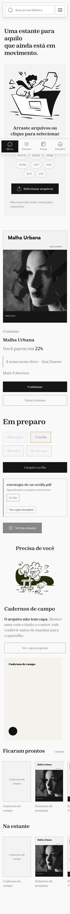
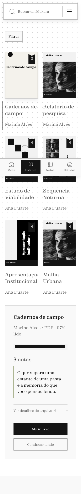
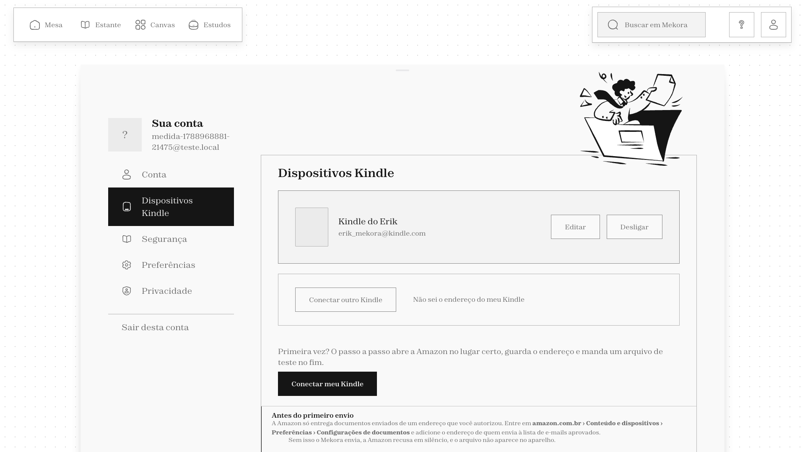

# Mekora

> Leitura, biblioteca e conhecimento em um único produto.

O **Mekora** transforma documentos em uma experiência de leitura contínua. A pessoa envia um arquivo, acompanha sua preparação, lê o resultado, registra destaques e notas e organiza o conhecimento em estudos e no Canvas.

Esta é a distribuição compartilhável do Mekora, sincronizada com o produto em
**1º de outubro de 2026**. Ela contém o mesmo código operacional da versão
principal, mas nunca inclui o acervo, banco, credenciais, modelos baixados,
arquivos convertidos, logs ou demais dados da instalação de desenvolvimento.
Nesta revisão, a origem funcional corresponde ao commit `0606890` do Mekora
principal; os iniciadores próprios da distribuição para Windows são mantidos.

## O produto

- recebe PDF, EPUB, DOCX, RTF e arquivos de quadrinhos;
- analisa, converte e valida o material antes de adicioná-lo à biblioteca;
- aplica OCR e tradução local, sem enviar o conteúdo para serviços externos;
- oferece leitor responsivo com índice, progresso, marcadores, destaques e notas;
- organiza o trabalho em Mesa, Estante, Notas, Estudos e Canvas;
- permite retomar a leitura e a preparação entre sessões;
- envia livros para dispositivos Kindle e importa `My Clippings.txt`;
- funciona em desktop e celular, com temas claro e escuro;
- protege documentos por sessão e endereços públicos não sequenciais.

## Interface

### Mesa no celular



### Estante no celular



### Leitor em desktop



Mais evidências visuais estão em [`docs/auditoria-mobile`](docs/auditoria-mobile) e [`docs/imagens`](docs/imagens).

## Arquitetura

```text
Navegador
   │
   ▼
Caddy ── interface React/Vite
   │
   └──── API FastAPI ── SQLAlchemy/SQLite
              │
              └── Calibre, Tesseract, Ghostscript, KCC e Argos Translate
```

- **Frontend:** React 19, Vite e React Router;
- **Backend:** Python 3.11, FastAPI, SQLAlchemy e Alembic;
- **Dados:** SQLite e diretório persistente de arquivos;
- **Processamento:** Calibre, OCRmyPDF/Tesseract, Ghostscript, KCC e Argos Translate;
- **Produção:** Docker Compose e Caddy com TLS automático.

## Executar localmente

### Windows 10/11

Instale o [Docker Desktop](https://www.docker.com/products/docker-desktop/) com
WSL 2 e dê dois cliques em **`Iniciar Mekora.cmd`** depois de clonar o projeto:

```powershell
git clone https://github.com/ErikAbner/mekora-mvp.git
cd mekora-mvp
& '.\Iniciar Mekora.cmd'
```

O iniciador verifica o computador, prepara Python, Node, Calibre, OCR e tradução
dentro do Docker, espera o servidor responder e abre um link local já
autenticado. Use **`Parar Mekora.cmd`** para encerrar sem apagar livros, notas ou
progresso. Instruções completas estão em [`docs/USO-LOCAL.md`](docs/USO-LOCAL.md).

### macOS e Linux

Requisitos: Python 3.11, Node.js 20 ou superior e npm.

```bash
git clone https://github.com/ErikAbner/mekora-mvp.git
cd mekora-mvp

python3.11 -m venv .venv
source .venv/bin/activate
pip install -r backend/requirements.txt

cd web
npm ci
cd ..

bash scripts/ver.sh
```

O último comando inicia a aplicação, cria uma conta local, semeia dados demonstrativos e imprime um link de entrada. Para encerrar: `bash scripts/prova.sh parar`.

## Subir em produção

Requisitos: servidor Linux com Docker, domínio apontado para o servidor e uma conta SMTP.

```bash
git clone https://github.com/ErikAbner/mekora-mvp.git
cd mekora-mvp
cp .env.example .env
```

Preencha no `.env`:

- `MEKORA_DOMINIO`;
- `DONO_EMAIL`;
- `SMTP_HOST`, `SMTP_PORT`, `SMTP_USER` e `SMTP_PASS`;
- `KINDLE_EMAIL`, quando houver envio para um dispositivo padrão.

Depois:

```bash
docker compose up -d --build
docker compose ps
curl -fsS https://SEU-DOMINIO/health
```

O backend não expõe uma porta pública; Caddy serve a interface, encaminha somente as rotas da API e administra o TLS. O banco e os documentos ficam fora das imagens Docker, no diretório persistente `storage/`.

Antes de uma publicação real, siga integralmente o [checklist de go-live](docs/GO-LIVE.md) e o [guia de implantação](docs/SUBIR.md).

O portão completo da release pode ser repetido com:

```bash
bash scripts/verificar-release.sh
```

## Qualidade desta release

- **991 testes de backend aprovados** e nenhuma falha;
- **17 testes de interface e contratos aprovados**;
- build de produção aprovado com 230 módulos transformados;
- 18 rotas principais auditadas em desktop e 390 px;
- nenhum overflow horizontal nas rotas auditadas;
- nenhum segredo, banco, upload, log ou dado pessoal versionado.

O build ainda alerta que o pacote principal supera 500 kB. Isso é uma melhoria de desempenho planejada, não um bloqueio funcional do MVP.

## Estrutura do repositório

```text
backend/    API, regras de negócio, migrações e testes
web/        interface React e tokens do design system
contrato/   estados e contratos compartilhados
scripts/    execução, verificação, backup e restauração
docs/       produto, arquitetura, UX, segurança e operação
```

## Documentação essencial

- [Visão do produto](docs/PRODUTO.md)
- [Arquitetura e modelo do sistema](docs/SISTEMA.md)
- [Checklist de go-live](docs/GO-LIVE.md)
- [Implantação](docs/SUBIR.md)
- [Backup e restauração](docs/RESTAURAR.md)
- [Segurança e acesso](docs/ACESSO.md)
- [Relatório final de UX](docs/RELATORIO-FINAL-UX-2026-09-12.md)
- [Auditoria mobile](docs/AUDITORIA-MOBILE-FIGMA-2026-09-15.md)

## Privacidade

O conteúdo dos documentos é processado localmente pela instalação. Credenciais ficam somente no `.env`; bancos, arquivos enviados, resultados, retratos, modelos, logs e backups são ignorados pelo Git.

## Autor

Projeto desenvolvido por **Erik Abner**.
