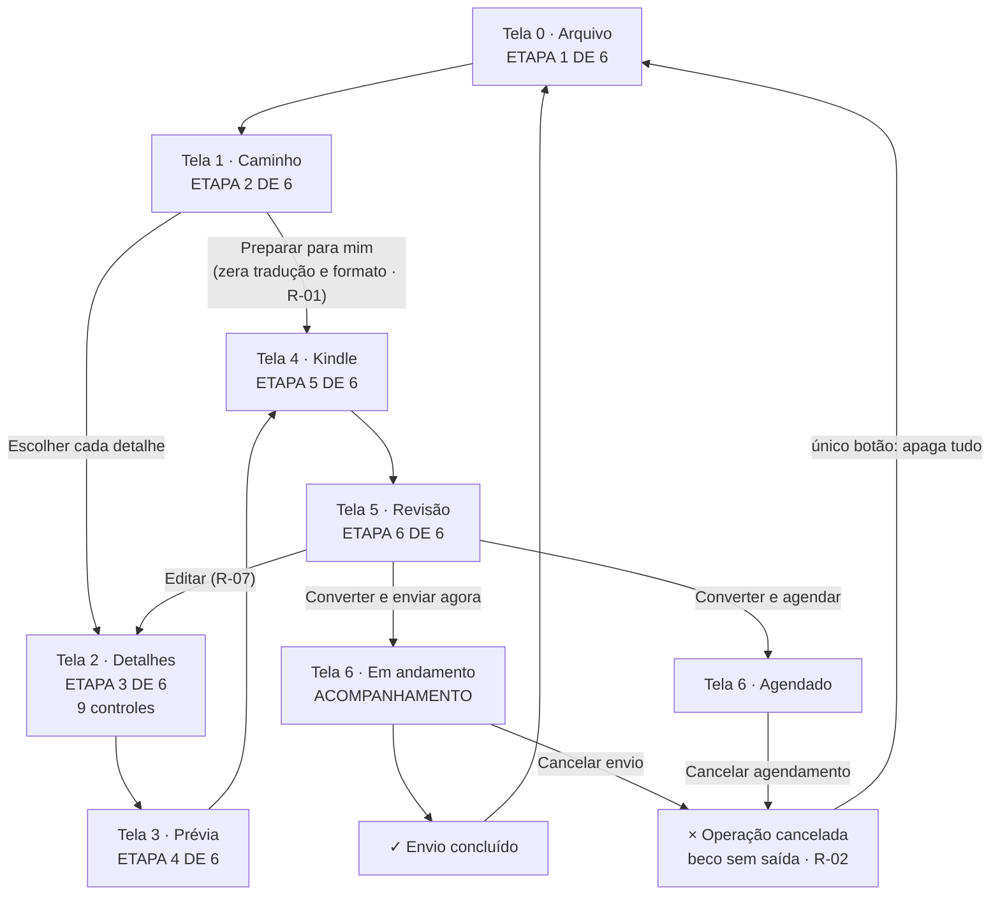
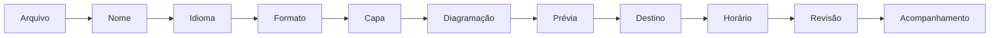
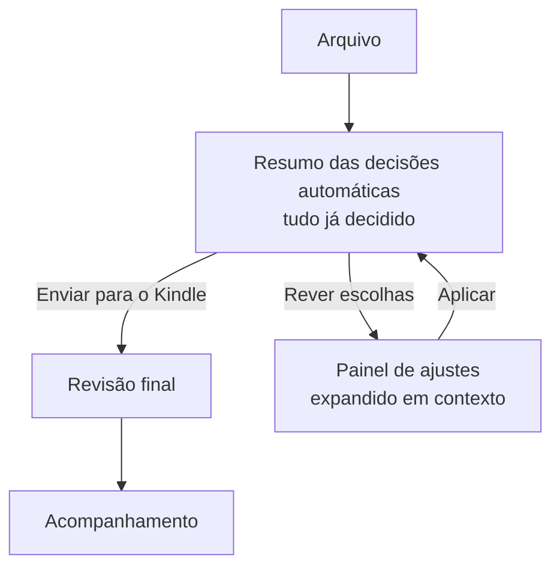
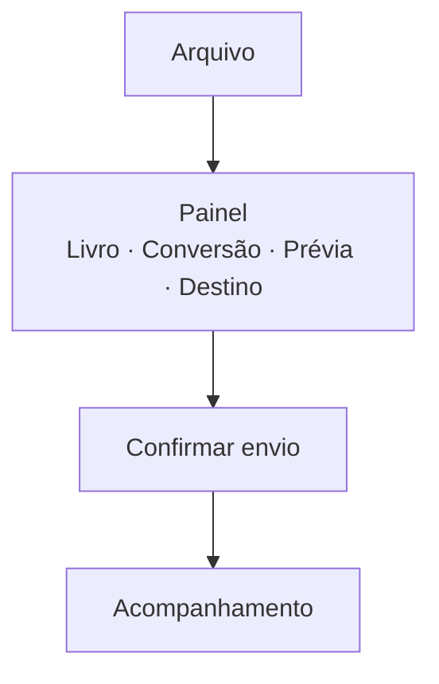

# Kindle Local — Teste do v2 e exploração de direções

**Material:** `index.html` v2 (24,6 KB) — MD5 `8c2ea1bd…`, diferente do v1 analisado (`6144a0bd…`)
**Método:** execução real em Chromium headless (Playwright), 1440×900 e 390×844, mais percurso só por teclado.
**Data:** 24/07/2026

**Convenções:** **[V]** verificado em execução · **[C]** lido no código, não exercitado · **[H]** hipótese sem participantes · **[R]** recomendação.
Não houve participantes humanos. Nenhum número de compreensão ou tempo neste documento é medição.

---

## 1. Resumo do que foi verificado

Naveguei os sete percursos pedidos. **O v2 corrigiu os dois S0 e a maior parte dos S1 do relatório anterior.** É um salto real, não cosmético.

### Corrigido — verificado em execução

| Correção | Evidência [V] |
|---|---|
| **Recomendado agora encurta de verdade** | `continueFromMode()` leva da etapa 1 direto à 4. Percurso recomendado: telas 0 → 1 → 4 → 5 → 6. Duas telas a menos, cinco decisões a menos |
| **Manual tem controle real** | Etapa 2 no modo manual expõe 9 controles: título, 3 rádios de tradução, formato, autor, série, capa, diagramação |
| **Agendado ≠ imediato** | Imediato: "Converter e enviar agora" → ◷ "Envio em andamento" → ✓ "Livro enviado com sucesso". Agendado: "Converter e agendar para Hoje, às 21h" → ◷ "Envio agendado" / "Tudo certo para Hoje, às 21h", com jornada própria ("Aguardando o horário programado") |
| **Data e hora personalizadas funcionam** | `<input type="datetime-local">` revelado ao selecionar a opção; `2020-01-01T10:00` rejeitado com "Escolha uma data e hora futuras" e foco devolvido a `#customDate`; `2027-03-15T21:30` aceito e formatado como `15/03/2027, 21:30` |
| **Progresso deixou de ser estático** | 12% → 34% em 1,5 s → 100% em ~6 s, com transição para ✓ "Envio concluído" |
| **Cancelamento existe nos dois estados** | "Cancelar envio" durante a conversão congela em 34% e leva a × "Operação cancelada". "Cancelar agendamento" idem |
| **Formato aparece no resumo** | Linha "Formato · AZW3 · R. L. Stevenson · Usar primeira página", exibida só no modo manual |
| **Foco gerenciado** | Após cada `go()`, o foco vai para o `<h1>` da tela com `tabindex="-1"`. Verificado: `H1 "Como você quer preparar o livro?"` |
| **Contador da tela final** | Etapa 6 agora exibe "ACOMPANHAMENTO", não "Revisão" |
| **Copy da privacidade reconciliada** | Etapa 6 diz "Mantenha esta aba aberta até a conversão terminar", coerente com "processado localmente" da etapa 4 |
| **Remetente autorizado** | Aviso novo na etapa 4: "Confirme nas preferências da Amazon que o remetente do Kindle Local está autorizado" |
| **Prévia menos presunçosa** | "Verificação automática sem alertas — confira você também", em vez de "Nenhum problema encontrado" |
| **"Reportar problema"** | Deixou de ser inerte (abre `alert()` explicativo) |

### Percursos executados

| Percurso | Status |
|---|---|
| Recomendado + envio imediato | ✅ completo, do arquivo ao ✓ final |
| Recomendado + agendamento | ✅ completo, estado final distinto |
| Manual + título, tradução, formato, autor, série, capa, diagramação | ⚠️ completo, mas dois campos somem do resumo |
| Manual + data e hora personalizadas | ✅ completo, com validação de data passada |
| Cancelamento do envio | ⚠️ funciona, mas o estado seguinte é um beco sem saída |
| Cancelamento do agendamento | ⚠️ idem |
| Retorno para editar escolhas | ❌ no recomendado, editar custa 4 telas |
| Desktop 1440×900 | ✅ sem rolagem horizontal |
| Mobile 390×844 | ❌ 5 botões "Editar" ocultos |
| Só teclado | ✅ percurso completo possível; foco agora vai ao título |

---

## 2. Regressões e problemas restantes

### Regressões — introduzidas pelo v2 [V]

| ID | Sev. | Evidência | Por que é regressão |
|---|---|---|---|
| **R-01** | **S1** | Em modo manual escolhi "Traduzir para inglês" e AZW3, voltei à etapa 1, escolhi "Preparar para mim" e continuei. Resultado: tradução voltou a `"Não traduzir"`, formato a `"EPUB otimizado"`. Causa: `continueFromMode()` sobrescreve os dois campos sem aviso. A mesma tela exibe, na `.lede`: *"Você pode mudar de caminho depois. Suas escolhas serão preservadas."* | No v1 o estado era preservado e o defeito era a copy do cartão mentir sobre ele. O v2 corrigiu o cartão **destruindo o estado** e manteve a promessa de preservação. Trocou um problema de texto por um de perda de dados, silenciosa e sem desfazer |
| **R-02** | **S1** | Após `cancelJob()`, a tela diz *"Suas escolhas continuam salvas. Você pode voltar e ajustar o que quiser"* e *"Volte à revisão para tentar novamente ou altere o agendamento"*. Único botão visível: `["Preparar outro arquivo"]`, que chama `resetFlow()` e zera título, e-mail, autor, série, formato, tradução, agendamento e data | O cancelamento é novo no v2 e nasceu num beco sem saída. A tela promete exatamente o oposto do que seu único controle faz |
| **R-03** | **S2** | Percurso recomendado: cartão promete `"3 etapas · cerca de 1 minuto"`; o indicador vai de `"ETAPA 2 DE 6"` para `"ETAPA 5 DE 6"` (barra salta de 33% para 83%), depois `"ETAPA 6 DE 6"`, depois `"ACOMPANHAMENTO"`. São 4 telas reais | O salto é consequência direta do encurtamento. Três numerações diferentes convivem: 3 (cartão), 6 (indicador), 4 (realidade) |
| **R-04** | **S2** | Preenchi Série = `"Clássicos de aventura"` e Diagramação = `"Margens compactas"`. No resumo: `"Clássicos de aventura" in .summary === False`, `"Margens compactas" in .summary === False`. Capa e autor aparecem | Os campos são novos no v2 e nasceram fora da confirmação. Dois parâmetros de conversão são enviados sem nunca serem confirmados |
| **R-05** | **S2** | `scheduleText()` concatena `" · Brasília (GMT−3)"` de forma fixa. Com o navegador em UTC, o resumo exibiu `"15/03/2027, 21:30 · Brasília (GMT−3)"`. A validação usa `new Date(customDate.value) > new Date()`, que opera no fuso local do navegador | O agendamento personalizado é novo. O rótulo afirma um fuso, o cálculo usa outro. Para quem viaja ou usa VPN, o horário exibido é falso |
| **R-06** | **S2 (a11y)** | `[data-step="6"]` inteiro tem `aria-live="polite"` e `#progressText` está dentro dele (`closest('[aria-live]') === true`). O progresso atualiza a cada 650 ms, 9 vezes até 100% | O progresso animado é a correção de um achado anterior, e criou outro: leitor de tela recebe ~9 anúncios em 6 segundos, mais as trocas de `statusTitle`, `statusLede` e `statusEyebrow` |
| **R-07** | **S2** | No recomendado: revisão → "Editar" em Livro → etapa 2 → Continuar → etapa 3 (prévia) → Continuar → etapa 4 → Continuar → revisão. Quatro telas para corrigir um título | O recomendado passou a pular as etapas 2 e 3, mas "Editar" reinjeta o usuário no caminho longo. Não existe "Salvar e voltar à revisão" |
| **R-08** | **S3** | Após `cancelJob()`: `sendButton.disabled === true`. Só `resetFlow()` religa | Se R-02 for corrigido com um caminho de volta à revisão, o botão de envio estará morto ao chegar lá |
| **R-09** | **S3** | `resetFlow()` restaura title, email, author, series, format, translation, schedule e customDate — **não** restaura `coverChoice` nem `layoutChoice` [C] | Os dois campos são novos; ficaram de fora do reset |
| **R-10** | **S3** | `"Otimizando fontes e imagens · 34%"` — incremento fixo de 11 pontos a cada 650 ms | Anima bem e torna o estado testável, mas apresenta um número inventado com precisão de medição. A regra do briefing pede não tratar progresso fictício como medição real |

### Permanecem do relatório anterior — reverificados no v2 [V]

| Ex-ID | Sev. | Estado |
|---|---|---|
| KL-08 | S1 | Os **três** erros (`#titleError`, `#emailError`, `#dateError`) continuam sem `role="alert"`; campos sem `aria-invalid` e sem `aria-describedby` |
| KL-07 (parte) | S1 | Foco corrigido ✅, mas **não há `role="progressbar"`** (0 ocorrências) e o indicador de etapa continua fora de região live |
| KL-09 | S1 | Sem History API (`history.length` fixo em 2), sem `beforeunload`, recarregar volta à etapa 0 e descarta o e-mail digitado |
| KL-10 | S2 | Mobile continua ocultando os botões "Editar" — agora são **5**, todos com `display:none`, 0 visíveis |
| KL-06 | S1→S2 | O aviso sobre remetente autorizado foi adicionado ✅, mas o campo continua aceitando qualquer domínio sem verificação |
| KL-15 | S2 | "Salvar e sair", "Trocar arquivo" e as 5 miniaturas `.page` continuam inertes ("Reportar problema" foi corrigido) |
| KL-18 | S2 | Faixa das 5 páginas no mobile: `scrollWidth 677` contra `clientWidth 356`, sem indicador |
| KL-19 | S2 | Mobile continua ocultando `.pill` "Verificado" e o rodapé de privacidade |
| KL-17 | S2 | "Traduzir para português" continua oferecido para um arquivo detectado como português |
| KL-20 | S2 | `maxlength="100"` sem contador |
| KL-21 | S3 | `prefers-reduced-motion` ausente do CSS |
| KL-22 | S3 | `#email` continua `type="text"` sem `autocomplete` |
| KL-23 | S3 | Etapa 0 continua com `<h2>` |
| KL-25 | S3 | Alvos de 19 px: "Salvar e sair", 4× "Editar", "← Voltar e editar" |

**Balanço:** dois S0 eliminados, quatro S1 resolvidos, dois S1 novos, e o conjunto de problemas de acabamento e acessibilidade estática praticamente intacto. **[H]** O v2 está a poucas horas de trabalho de ser testável com usuários — R-01 e R-02 são os bloqueios.

---

## 3. Mapa atual da jornada



**Leitura.** O esqueleto está certo. Os três pontos vermelhos: o desvio do recomendado destrói estado (R-01), o retorno para editar não retorna (R-07), e o cancelamento termina num estado que promete reversibilidade e entrega apagamento (R-02).

---

## 4. Direção A — Assistente linear

**Princípio:** uma pergunta por tela, progresso explícito, nenhuma tela com mais de uma decisão.

### Mapa



**Telas:** 11 no caminho completo. Com "Preparar para mim", 4 (Arquivo → Prévia resumida → Destino+Horário → Revisão).

### Wireframe desktop 1440 — tela "Idioma"

```
┌──────────────────────────────────────────────────────────────────────┐
│ k kindle local                                        Salvar e sair  │
├──────────────────────────────────────────────────────────────────────┤
│ PERGUNTA 3 DE 9                                             IDIOMA   │
│ ████████████░░░░░░░░░░░░░░░░░░░░░░░░░░░░░░░░░░░░░░░░░░░░░░░░░░░░░░░  │
├──────────────────────────────────────────────────────────────────────┤
│                                                                      │
│   O texto deve ser traduzido?                                        │
│   Detectamos português no arquivo original.                          │
│                                                                      │
│   ┌────────────────────────────────────────────────────────────┐     │
│   │ ● Não traduzir                              RECOMENDADO    │     │
│   │   Mantém o texto exatamente como o autor escreveu.         │     │
│   └────────────────────────────────────────────────────────────┘     │
│   ┌────────────────────────────────────────────────────────────┐     │
│   │ ○ Traduzir para inglês                                     │     │
│   │   Tradução automática. Pode alterar nuances.               │     │
│   └────────────────────────────────────────────────────────────┘     │
│                                                                      │
│   ⌄ O que muda na tradução automática                                │
│                                                                      │
├──────────────────────────────────────────────────────────────────────┤
│  ← Anterior                                        Próxima  →        │
└──────────────────────────────────────────────────────────────────────┘
```

### Wireframe mobile 390 — mesma tela

```
┌────────────────────────┐
│ k kindle    Salvar e ⋯ │
├────────────────────────┤
│ 3 DE 9 · IDIOMA        │
│ ██████░░░░░░░░░░░░░░░  │
├────────────────────────┤
│ O texto deve ser       │
│ traduzido?             │
│                        │
│ Detectamos português   │
│ no arquivo original.   │
│                        │
│ ┌────────────────────┐ │
│ │ ● Não traduzir     │ │
│ │   RECOMENDADO      │ │
│ │   Mantém o texto   │ │
│ │   como o autor     │ │
│ │   escreveu.        │ │
│ └────────────────────┘ │
│ ┌────────────────────┐ │
│ │ ○ Traduzir para    │ │
│ │   inglês           │ │
│ │   Pode alterar     │ │
│ │   nuances.         │ │
│ └────────────────────┘ │
│                        │
│ ⌄ O que muda           │
├────────────────────────┤
│ ←        Próxima  →    │ ← barra fixa
└────────────────────────┘
```

**Vantagens.** Carga cognitiva mínima por tela. Progresso honesto e fácil de acertar. Ótimo para leitor de tela: uma decisão, um anúncio, um `<h1>`. Trivial de instrumentar — cada tela é um evento.

**Riscos.** Nove telas para quem quer controle é fadiga, não poder. **[H]** O usuário avançado abandona ou passa batido apertando "Próxima". Perde-se a visão de conjunto: ninguém consegue comparar formato e diagramação se eles nunca aparecem juntos. E o custo de voltar cresce linearmente.

**Perfil mais bem atendido:** iniciante cauteloso, e usuário de leitor de tela.

**Pontos de abandono prováveis [H]:** telas 4–5 (capa e diagramação) para quem não sabe o que responder; e a transição da 6 para a 7, onde o e-mail do Kindle exige informação externa.

**Microcopy de exemplo.** Título sempre pergunta: *"O texto deve ser traduzido?"*. Apoio sempre traz o dado que motiva a pergunta: *"Detectamos português no arquivo original."* Botão sempre neutro: *"Próxima"* — nunca "Está tudo certo", que pede uma resposta que o botão não coleta.

**Quando escolher:** quando o público é majoritariamente iniciante, quando a acessibilidade é requisito de primeira ordem, ou quando cada decisão tem consequência grave e precisa de tela própria.

---

## 5. Direção B — Recomendação com resumo

**Princípio:** o sistema decide tudo, mostra o que decidiu numa tela, e o usuário aceita ou abre o que quiser rever.

### Mapa



**Telas:** 3 no caminho aceito (Arquivo → Resumo → Acompanhamento, com a revisão final embutida como confirmação). 4 quando há ajuste.

### Wireframe desktop 1440 — "Resumo das decisões automáticas"

```
┌────────────────────────────────────────────────────────────────────────┐
│ k kindle local                                          Salvar e sair  │
├────────────────────────────────────────────────────────────────────────┤
│                                                                        │
│  PREPARAMOS TUDO                                                       │
│  A ilha do tesouro está pronta                                         │
│  Revise o que decidimos. Nada é enviado até você confirmar.            │
│                                                                        │
│  ┌──────────────────────────────────────────────────────────────────┐  │
│  │ ┌────────┐  Nome      A ilha do tesouro                 Ajustar  │  │
│  │ │ ▓▓▓▓▓▓ │            do arquivo A_ilha_do_tesouro.epub          │  │
│  │ │ A ILHA │  ────────────────────────────────────────────────────  │  │
│  │ │   DO   │  Idioma    Não traduzir                      Ajustar  │  │
│  │ │TESOURO │            português original preservado              │  │
│  │ │ ▓▓▓▓▓▓ │  ────────────────────────────────────────────────────  │  │
│  │ └────────┘  Formato   EPUB otimizado                    Ajustar  │  │
│  │             Capa      original · margens automáticas             │  │
│  │             ────────────────────────────────────────────────────  │  │
│  │             Prévia    5 páginas sem alertas          Ver páginas │  │
│  │             ────────────────────────────────────────────────────  │  │
│  │             Destino   leitor_72@kindle.com               Ajustar │  │
│  │                       envio imediato · ~3 min                    │  │
│  └──────────────────────────────────────────────────────────────────┘  │
│                                                                        │
│  🔒 O arquivo é processado no seu computador. Só o resultado sai daqui. │
│                                                                        │
│  ┌────────────────────────────────┐                                    │
│  │  Converter e enviar agora   →  │   Escolher cada detalhe            │
│  └────────────────────────────────┘                                    │
│  Você poderá cancelar enquanto a conversão estiver em andamento.       │
└────────────────────────────────────────────────────────────────────────┘
```

**Estado expandido** — clicar "Ajustar" em Idioma abre em linha, sem trocar de tela:

```
│             ────────────────────────────────────────────────────  │
│             Idioma    ┌──────────────────────────────────────┐    │
│                       │ ● Não traduzir          RECOMENDADO  │    │
│                       │ ○ Traduzir para inglês               │    │
│                       └──────────────────────────────────────┘    │
│                                      Cancelar   Aplicar           │
│             ────────────────────────────────────────────────────  │
```

### Wireframe mobile 390

```
┌────────────────────────┐
│ k kindle    Salvar e ⋯ │
├────────────────────────┤
│ PREPARAMOS TUDO        │
│                        │
│ A ilha do tesouro      │
│ está pronta            │
│                        │
│ Revise o que           │
│ decidimos. Nada é      │
│ enviado até você       │
│ confirmar.             │
│                        │
│  ┌──────┐              │
│  │A ILHA│  EPUB 2,8 MB │
│  │  DO  │  248 páginas │
│  │TESOU.│              │
│  └──────┘              │
│ ┌────────────────────┐ │
│ │ Nome            ›  │ │  ← linha inteira
│ │ A ilha do tesouro  │ │     é o alvo (56px)
│ ├────────────────────┤ │
│ │ Idioma          ›  │ │
│ │ Não traduzir       │ │
│ ├────────────────────┤ │
│ │ Formato         ›  │ │
│ │ EPUB · capa orig.  │ │
│ ├────────────────────┤ │
│ │ Prévia          ›  │ │
│ │ 5 páginas, ok      │ │
│ ├────────────────────┤ │
│ │ Destino         ›  │ │
│ │ leitor_72@…        │ │
│ │ agora · ~3 min     │ │
│ └────────────────────┘ │
│                        │
│ 🔒 Processado no seu   │
│    aparelho.           │
├────────────────────────┤
│ ┌────────────────────┐ │ ← barra fixa
│ │ Converter e enviar │ │
│ └────────────────────┘ │
│ Escolher cada detalhe  │
└────────────────────────┘
```

**Vantagens.** O caminho feliz tem 3 telas. Nada é escondido — a diferença entre "reduzir decisões" e "reduzir transparência" é exatamente esta tela, que mostra todas as decisões e torna cada uma opcionalmente editável. Editar não custa navegação: expande em contexto e volta ao mesmo lugar. Resolve R-01, R-04 e R-07 por construção.

**Riscos.** A tela é densa — **[H]** risco real de o usuário rolar até o botão sem ler, o que devolve o problema de transparência por outra porta. Exige que a detecção automática seja boa: se o nome sugerido estiver errado com frequência, a tela vira uma lista de correções e perde a vantagem. Implementação mais cara: edição em linha com estados de erro dentro de uma tela só.

**Perfil mais bem atendido:** leitor frequente e mobile com pressa. Serve bem o iniciante cauteloso, porque mostra tudo antes de pedir confiança.

**Pontos de abandono prováveis [H]:** a linha "Destino", se o usuário não souber o próprio e-mail do Kindle — é o único dado que exige buscar informação fora do app.

**Microcopy de exemplo.** *"Revise o que decidimos. Nada é enviado até você confirmar."* — nomeia o agente ("decidimos"), o objeto ("o que") e a garantia, em 11 palavras. Botão secundário é *"Escolher cada detalhe"*, não "Configuração avançada": descreve a ação, não o perfil de quem a usa.

**Quando escolher:** quando a detecção automática é confiável, quando a maioria das sessões é repetição da mesma tarefa, e quando velocidade é a métrica principal.

---

## 6. Direção C — Painel configurável

**Princípio:** tudo numa tela, organizado em seções, com resumo fixo e envio sempre alcançável.

### Mapa



**Telas:** 3 (Arquivo → Painel → Acompanhamento), com o painel contendo tudo.

### Wireframe desktop 1440 — duas colunas

```
┌──────────────────────────────────────────────────────────────────────────────┐
│ k kindle local                                                Salvar e sair  │
├──────────────────────────────────────────────────────────────────────────────┤
│  Preparar A_ilha_do_tesouro.epub          ┌───────────────────────────────┐   │
│                                           │  RESUMO            (fixo)     │   │
│  ┌─── LIVRO ───────────────────────────┐  │                               │   │
│  │ Nome no Kindle                      │  │  ┌──────┐  A ilha do tesouro  │   │
│  │ [A ilha do tesouro            ] 18/100│  │ │A ILHA│  Robert L. Steven.  │   │
│  │ Autor                               │  │  │  DO  │                     │   │
│  │ [Robert Louis Stevenson       ]     │  │  │TESOU.│  EPUB otimizado     │   │
│  │ Série — opcional                    │  │  └──────┘  Não traduzir       │   │
│  │ [                             ]     │  │            Capa original      │   │
│  └─────────────────────────────────────┘  │            Margens auto       │   │
│                                           │                               │   │
│  ┌─── CONVERSÃO ───────────────────────┐  │  Destino                      │   │
│  │ Formato    [EPUB otimizado    ▾]    │  │  leitor_72@kindle.com         │   │
│  │  melhor compatibilidade             │  │  Agora · ~3 min               │   │
│  │ Tradução   ● Não traduzir           │  │                               │   │
│  │            ○ Inglês                 │  │  🔒 Processado no seu          │   │
│  │ Capa       [Manter original    ▾]   │  │     computador.               │   │
│  │ Diagramação[Otimizar auto      ▾]   │  │                               │   │
│  └─────────────────────────────────────┘  │ ┌───────────────────────────┐ │   │
│                                           │ │ Converter e enviar   →    │ │   │
│  ┌─── PRÉVIA ──────────────────────────┐  │ └───────────────────────────┘ │   │
│  │ ▢ ▢ ▢ ▢ ▢   5 páginas · sem alertas │  │ Nada é enviado antes de você  │   │
│  │ Ampliar página          Reportar    │  │ confirmar nesta tela.         │   │
│  └─────────────────────────────────────┘  └───────────────────────────────┘   │
│                                                                              │
│  ┌─── DESTINO E HORÁRIO ───────────────┐                                      │
│  │ E-mail  [leitor_72@kindle.com  ]    │                                      │
│  │  ⓘ autorize o remetente na Amazon   │                                      │
│  │ Envio   ● Agora  ○ Hoje 21h  ○ Data │                                      │
│  └─────────────────────────────────────┘                                      │
└──────────────────────────────────────────────────────────────────────────────┘
```

### Wireframe mobile 390 — acordeão

```
┌────────────────────────┐
│ k kindle    Salvar e ⋯ │
├────────────────────────┤
│ Preparar               │
│ A_ilha_do_tesouro.epub │
│                        │
│ ┌────────────────────┐ │
│ │ ▾ LIVRO            │ │ ← aberto
│ │ Nome no Kindle     │ │
│ │ [A ilha do tesou.] │ │
│ │ Autor              │ │
│ │ [Robert Louis St.] │ │
│ │ Série — opcional   │ │
│ │ [                ] │ │
│ ├────────────────────┤ │
│ │ › CONVERSÃO        │ │ ← fechado
│ │   EPUB · original  │ │    com resumo
│ ├────────────────────┤ │
│ │ › PRÉVIA           │ │
│ │   5 páginas, ok    │ │
│ ├────────────────────┤ │
│ │ › DESTINO          │ │
│ │   leitor_72@… hoje │ │
│ └────────────────────┘ │
│                        │
│ 🔒 Processado aqui.    │
├────────────────────────┤
│ ┌────────────────────┐ │ ← barra fixa
│ │ Converter e enviar │ │
│ └────────────────────┘ │
│ Nada sai sem confirmar │
└────────────────────────┘
```

**Vantagens.** Controle máximo com custo de navegação zero: tudo visível, tudo comparável, edição em qualquer ordem. Um usuário avançado que faz isso toda semana conclui em segundos. O resumo fixo garante que a confirmação nunca some de vista.

**Riscos.** Muros de formulário afastam iniciantes. **[H]** O maior risco não é confusão, é intimidação — a tela comunica "isto é complicado" antes de qualquer leitura. No mobile, o acordeão obriga a decidir o que abrir sem saber o que há dentro. E a confirmação num painel sempre editável enfraquece o princípio de "nada é enviado sem confirmação explícita": não há um momento ritualizado de revisão.

**Perfil mais bem atendido:** usuário avançado, e qualquer pessoa em uso repetido.

**Pontos de abandono prováveis [H]:** o primeiro contato do iniciante com a tela cheia; e o mobile, onde o acordeão fechado esconde a extensão real do trabalho.

**Microcopy de exemplo.** Seções nomeadas por objeto, não por etapa: *"Livro"*, *"Conversão"*, *"Prévia"*, *"Destino e horário"*. Cada seção fechada mostra seu estado atual (*"EPUB · original"*), nunca só o nome. Sob o botão: *"Nada é enviado antes de você confirmar nesta tela."* — porque num painel a confirmação precisa ser localizada explicitamente.

**Quando escolher:** ferramenta profissional, uso frequente pelo mesmo usuário, público que já entende os conceitos.

---

## 7. Tabela comparativa

Notas de 1 a 5, **julgamento especialista [H]**, não medição.

| Critério | A · Assistente linear | B · Recomendação com resumo | C · Painel configurável |
|---|:---:|:---:|:---:|
| Velocidade | 2 | **5** | 4 |
| Compreensão | **5** | 4 | 2 |
| Confiança | 4 | **5** | 3 |
| Controle | 3 | 4 | **5** |
| Reversibilidade | 2 | **5** | 4 |
| Acessibilidade | **5** | 4 | 3 |
| Adequação a iniciantes | **5** | 4 | 1 |
| Adequação a avançados | 2 | 3 | **5** |
| Complexidade de implementação | **5** (mais simples) | 3 | 2 |
| **Média** | 3,7 | **4,1** | 3,2 |

**Notas de leitura.** A média favorece B, mas não é o argumento — é a distribuição. A não tem nenhum ponto fraco grave exceto velocidade e controle, que são exatamente os dois objetivos declarados do produto. C é excelente para um perfil e péssimo para outro. B é o único que não fica abaixo de 4 em nenhum critério que o briefing lista como objetivo.

**Reversibilidade merece destaque.** É onde o protótipo atual mais sofre (R-02, R-07) e onde as direções mais divergem: em A, voltar custa N telas; em B, editar não sai da tela; em C, tudo é sempre editável até a confirmação.

---

## 8. Direção recomendada

### **Direção B como espinha, com o painel da Direção C como caminho manual.**

Isto não é meio-termo: é o desenho que o próprio v2 já está tentando alcançar. O v2 encurtou o recomendado (acerto de B) e adensou o manual (acerto de C), mas manteve os dois dentro de um assistente linear herdado de A — e é dessa mistura que nascem R-01, R-03 e R-07.

**Os dois caminhos passam a ser estruturalmente diferentes, não versões longa e curta do mesmo:**

- **"Preparar para mim"** → tela de resumo das decisões automáticas, com edição em linha. Uma tela, todas as decisões visíveis, nenhuma navegação para ajustar.
- **"Escolher cada detalhe"** → painel em seções, com resumo fixo. Uma tela, todos os controles, ordem livre.

Ambos convergem para a mesma confirmação e o mesmo acompanhamento. O usuário troca de caminho a qualquer momento e **nada é redefinido**, porque os dois operam sobre o mesmo objeto de estado — o que elimina R-01 por construção, e não por correção pontual.

### O que manter do protótipo

- A tela 0 (Arquivo), praticamente intacta: capa, tamanho, páginas e idioma detectado respondem antes da pergunta.
- A explicação da recomendação de idioma: *"O arquivo já está em português — opção mais fiel"*. É o melhor texto do protótipo.
- O bloco de privacidade, promovido para a tela 0.
- Os rótulos condicionais do v2: *"Converter e enviar agora"* / *"Converter e agendar para…"*.
- Os três estados finais distintos do v2: em andamento, agendado, cancelado — a estrutura está certa, os becos sem saída não.
- A jornada de quatro passos do acompanhamento, que separa converter, enviar e aparecer na biblioteca.
- A gestão de foco introduzida no v2 (`heading.focus()`).
- O aviso sobre remetente autorizado.

### O que remover

- **O indicador "Etapa N de 6".** Com caminhos de comprimentos diferentes, ele nunca vai estar certo (R-03). Substituir por rótulo do estado atual, sem numeração.
- **A tela 2 como etapa obrigatória do recomendado.** Já foi removida no v2; consolidar.
- **A tela 3 (Prévia) como etapa separada.** Vira um bloco dentro do resumo/painel, expansível.
- **"Salvar e sair"** e **"Trocar arquivo"**, até existirem.
- **A opção "Traduzir para português"** quando o arquivo já está em português.
- **`continueFromMode()`** inteiro — a função que causa R-01.

### O que redesenhar

- **A revisão final.** Deixa de ser tela e vira confirmação sobre o resumo: o resumo *é* a revisão. Isso preserva "nada é enviado sem confirmação explícita" com um clique deliberado num botão que lista o que vai acontecer, e elimina a duplicação atual entre a tela 5 e a tela de resumo.
- **O estado cancelado.** Passa a ter dois botões: *"Voltar e ajustar"* (retorna ao resumo com tudo intacto) e *"Preparar outro arquivo"* (reset). Resolve R-02 e R-08.
- **O acompanhamento.** `role="progressbar"` com `aria-valuetext`, e região live restrita às transições de estado, não à porcentagem (resolve R-06).
- **A edição no mobile.** Linhas inteiras clicáveis, com altura mínima de 56 px (resolve KL-10 e KL-25 de uma vez).
- **Série e diagramação** entram no resumo (resolve R-04).
- **O fuso horário** passa a ser detectado, exibido e editável (resolve R-05).

### Telas do próximo protótipo

1. Arquivo · 2. Escolha de caminho · 3. Resumo das decisões automáticas (com edição em linha) · 4. Painel de configuração manual · 5. Prévia expandida (sobreposição, não tela) · 6. Acompanhamento em andamento · 7. Acompanhamento agendado · 8. Concluído · 9. Cancelado · 10. Erro recuperável.

### Hipóteses que precisam de usuários reais

1. **[H]** A tela de resumo é lida, ou rolada até o botão? É a hipótese que sustenta toda a Direção B — se não for lida, B esconde tanto quanto um "automático" opaco.
2. **[H]** Edição em linha é entendida como edição, ou o usuário procura uma tela?
3. **[H]** Um usuário avançado prefere o painel a um assistente, ou o assistente lhe dá mais confiança de não ter esquecido nada?
4. **[H]** A remoção do "Etapa N de 6" aumenta a ansiedade do iniciante, que perde a noção de quanto falta?
5. **[H]** O estado "agendado" é entendido como "ainda não foi enviado"?

---

## 9. Fluxo detalhado da próxima versão

Especificação das dez telas. Para cada uma: objetivo, informação principal, ações, estados, desktop vs. mobile, foco e acessibilidade, e relação com o que vem antes e depois.

---

### Tela 1 · Arquivo

**Objetivo:** confirmar que o arquivo certo foi lido e que ele é tratável, antes de qualquer decisão.
**Informação principal:** capa, nome do arquivo, formato, tamanho, número de páginas, idioma detectado, selo de verificação.
**Ação primária:** "Começar preparação".
**Ação secundária:** "Trocar arquivo".
**Estados:** verificado · com aviso (fonte incorporada faltando, imagens em baixa resolução) · não suportado (DRM, corrompido, formato incompatível, tamanho acima do limite).
**Desktop:** cartão horizontal, capa 100 px à esquerda.
**Mobile:** capa 72 px, selo "Verificado" abaixo do nome — **não ocultar** (corrige KL-19).
**Foco e acessibilidade:** `<h1>` recebe foco ao carregar; o selo é texto, não só cor; o bloco de privacidade entra aqui, visível nos dois viewports.
**Antes:** anexo do arquivo. **Depois:** escolha de caminho.

---

### Tela 2 · Escolha entre recomendado e manual

**Objetivo:** deixar a pessoa escolher quanto controle quer, com informação suficiente para a escolha ser real.
**Informação principal:** o que cada caminho decide por você e o que deixa em suas mãos.
**Ação primária:** "Continuar" com o cartão selecionado.
**Ação secundária:** trocar o cartão selecionado; "← Voltar".
**Estados:** recomendado selecionado (padrão) · manual selecionado · **estado novo:** "você já fez ajustes" — quando o usuário volta a esta tela com alterações, o cartão recomendado exibe *"Você ajustou: idioma, formato"* e um link *"Restaurar recomendações"*. Nada é sobrescrito automaticamente (corrige R-01).
**Desktop:** dois cartões lado a lado.
**Mobile:** empilhados, cartão recomendado primeiro, ambos com alvo de toque em toda a área.
**Foco e acessibilidade:** os dois cartões viram um `role="radiogroup"` com dois `role="radio"` — semanticamente correto para escolha mutuamente exclusiva, e habilita navegação por setas. Estado exposto por `aria-checked` + ✓ + borda, nunca só por cor.
**Antes:** arquivo. **Depois:** resumo (recomendado) ou painel (manual).

---

### Tela 3 · Resumo das decisões automáticas

**Objetivo:** mostrar tudo o que foi decidido em nome da pessoa e permitir ajustar qualquer item sem sair da tela.
**Informação principal:** nome, idioma, formato, capa, diagramação, prévia, destino e horário — cada um com o valor decidido e o motivo quando houver.
**Ação primária:** "Converter e enviar agora" (ou "Converter e agendar para…").
**Ação secundária:** "Ajustar" por linha; "Escolher cada detalhe" para migrar ao painel.
**Estados:** padrão · linha em edição · linha com erro de validação · linha ajustada (marcada como "alterado por você") · agendado (a linha Destino muda de forma e o botão primário troca de rótulo).
**Desktop:** capa à esquerda, lista de linhas à direita, edição expande em linha empurrando o conteúdo abaixo.
**Mobile:** linha inteira clicável, mínimo 56 px de altura, com "›" à direita; edição abre em folha inferior (bottom sheet) que devolve o foco à linha ao fechar. **Nenhuma ação de edição é removida no mobile** (corrige KL-10).
**Foco e acessibilidade:** abrir uma linha move o foco para o primeiro controle dela; fechar devolve ao gatilho. `aria-expanded` no gatilho. Erro com `role="alert"` + `aria-invalid` + `aria-describedby` (corrige KL-08).
**Antes:** escolha de caminho. **Depois:** acompanhamento — esta tela é também a confirmação.

---

### Tela 4 · Configuração manual (painel)

**Objetivo:** dar controle real e simultâneo sobre conversão, metadados e destino.
**Informação principal:** quatro seções — Livro (nome, autor, série), Conversão (formato, tradução, capa, diagramação), Prévia, Destino e horário — mais um resumo fixo que espelha o resultado.
**Ação primária:** "Converter e enviar" no resumo fixo.
**Ação secundária:** "Voltar ao modo recomendado" (sem perder nada); "Restaurar padrões" por seção.
**Estados:** padrão · seção com erro · campo alterado (marcado) · agendado.
**Desktop:** duas colunas, resumo fixo à direita (`position: sticky`).
**Mobile:** acordeão; cada seção fechada exibe seu estado atual, nunca só o nome; barra inferior fixa com o botão primário e o texto de confirmação.
**Foco e acessibilidade:** cada seção é `<fieldset>` com `<legend>`; o acordeão usa `aria-expanded` e `aria-controls`; o resumo fixo não é região live (evita R-06) — atualiza silenciosamente e é lido sob demanda.
**Antes:** escolha de caminho, ou o resumo. **Depois:** acompanhamento.

---

### Tela 5 · Curadoria das cinco primeiras páginas

**Objetivo:** deixar a pessoa ver de fato como o livro chegará, não apenas ser informada de que está tudo bem.
**Informação principal:** cinco miniaturas com rótulo e status individual; resultado da verificação automática.
**Ação primária:** "Está tudo certo" → fecha e volta ao resumo/painel.
**Ação secundária:** "Ampliar página" (a ação que hoje falta); "Reportar problema" com escolha da página e descrição.
**Estados:** todas legíveis · uma ou mais com aviso (fonte, margem, imagem) · problema reportado pela pessoa · não gerada (falha na renderização da prévia).
**Desktop:** sobreposição sobre o resumo, cinco miniaturas em linha, ampliação em painel lateral.
**Mobile:** tela cheia, carrossel com `scroll-snap` e indicador "3 de 5" — **corrige a rolagem invisível** (KL-18).
**Foco e acessibilidade:** as miniaturas só são focáveis quando ampliáveis (hoje são botões inertes — KL-15); a sobreposição é `role="dialog"` com `aria-modal`, foco preso dentro e Esc para fechar, devolvendo o foco ao gatilho. Cada miniatura tem nome acessível descritivo, não apenas o texto visual.
**Antes:** resumo ou painel. **Depois:** volta para onde foi aberta.

---

### Tela 6 · Destino e agendamento

**Objetivo:** definir para onde e quando, com o fuso correto e sem ambiguidade sobre irreversibilidade.
**Informação principal:** e-mail do Kindle, momento do envio, fuso detectado, aviso sobre remetente autorizado.
**Ação primária:** "Aplicar" (dentro do resumo) ou "Continuar" (no painel).
**Ação secundária:** "Como descubro meu e-mail do Kindle?".
**Estados:** agora · hoje às 21h · data e hora personalizadas · e-mail inválido · domínio não-Kindle (aviso, não bloqueio — corrige KL-06) · data no passado · fuso diferente do detectado anteriormente.
**Desktop e mobile:** iguais em estrutura; no mobile o `datetime-local` usa o seletor nativo.
**Foco e acessibilidade:** o campo de data só entra na ordem de foco quando visível; o fuso é texto, não `title`; erro de data com `role="alert"`.
**Antes:** resumo ou painel. **Depois:** confirmação.

---

### Tela 7 · Revisão antes da confirmação

**Objetivo:** o momento deliberado em que a pessoa autoriza uma ação com efeito externo.

Nesta direção **não é uma tela separada** — é o bloco de confirmação ao pé do resumo ou do painel. O princípio de "nada é enviado sem confirmação explícita" é preservado por três elementos, não por uma tela a mais:

1. o botão nomeia a ação completa e o momento: *"Converter e enviar agora"* / *"Converter e agendar para 15/03/2027, 21:30 (Brasília, GMT−3)"*;
2. a linha abaixo declara a reversibilidade real: *"Você poderá cancelar enquanto a conversão estiver em andamento"*;
3. o botão fica desabilitado enquanto houver erro de validação em qualquer seção, com o motivo nomeado.

**Estados:** pronto · bloqueado por erro (com lista dos campos) · em envio (desabilitado, rótulo "Preparando…").
**Foco e acessibilidade:** ao bloquear, o motivo é anunciado por `role="status"`; o botão nunca fica desabilitado sem explicação visível adjacente.

---

### Tela 8 · Conversão em andamento

**Objetivo:** mostrar o que está acontecendo, quanto falta e como parar.
**Informação principal:** jornada de quatro passos — preparado · convertendo · enviando · disponível na biblioteca — com o passo atual destacado.
**Ação primária:** "Cancelar envio".
**Ação secundária:** nenhuma até concluir.
**Estados:** convertendo · enviando · aguardando sincronização · falha (ver tela 10).
**Desktop e mobile:** iguais; no mobile a jornada ocupa a tela toda.
**Foco e acessibilidade:** `role="progressbar"` com `aria-valuenow`, `aria-valuemin`, `aria-valuemax` e `aria-valuetext="Convertendo, 34 por cento"` (corrige a lacuna do KL-07). **A região live cobre apenas a mudança de passo**, não a porcentagem — o progresso numérico é lido sob demanda pelo `progressbar`, não empurrado a cada 650 ms (corrige R-06).
**Sobre o número:** enquanto for protótipo, o percentual deve ser rotulado como simulado na interface de teste, ou substituído por um indicador indeterminado por passo (corrige R-10).
**Antes:** confirmação. **Depois:** concluído, cancelado ou erro.

---

### Tela 9 · Envio agendado

**Objetivo:** deixar inequívoco que **nada foi enviado ainda** e que a pessoa continua no controle.
**Informação principal:** data, hora e fuso do envio programado; jornada com o passo "Aguardando o horário programado" ativo; destino.
**Ação primária:** "Cancelar agendamento".
**Ação secundária:** "Alterar horário" — hoje prometida no texto e inexistente como controle.
**Estados:** aguardando · convertendo (quando o horário chega) · cancelado · falhou no horário programado.
**Desktop e mobile:** iguais.
**Foco e acessibilidade:** o `<h1>` nomeia o estado e o horário juntos: *"Agendado para 15/03/2027, 21:30"* — quem usa leitor de tela ouve as duas informações no primeiro anúncio.
**Antes:** confirmação. **Depois:** conversão, no horário; ou cancelado.

---

### Tela 10 · Concluído / erro recuperável / cancelado

Três estados de uma mesma tela, com a mesma estrutura e ações diferentes.

**Concluído.** Objetivo: fechar o ciclo e dizer o que fazer no aparelho.
Informação principal: ✓, "Livro enviado", nome do livro, destino, e o próximo passo físico — *"Conecte o Kindle ao Wi-Fi e toque em Sincronizar na biblioteca"*.
Ação primária: "Preparar outro arquivo". Secundária: "Ver detalhes do envio".

**Cancelado.** Objetivo: garantir que cancelar não custou o trabalho.
Informação principal: ×, "O arquivo não foi enviado", e o que continua salvo.
**Ação primária: "Voltar e ajustar"** — retorna ao resumo com tudo intacto e o botão de envio reabilitado (corrige R-02 e R-08).
Ação secundária: "Preparar outro arquivo", com confirmação de que isso descarta as escolhas.

**Erro recuperável.** Objetivo: nomear o que falhou, em qual passo, e oferecer a ação que resolve.
Informação principal: em qual dos quatro passos parou, o que aconteceu em linguagem comum, e se o arquivo convertido foi preservado.
Ação primária: varia com o erro — "Tentar enviar de novo" (falha de envio, conversão preservada) · "Autorizar o remetente e tentar de novo" (remetente não autorizado, com link) · "Escolher outro formato" (falha de conversão).
Ação secundária: "Voltar e ajustar"; "Baixar o arquivo convertido" quando a conversão tiver terminado — o trabalho não se perde por uma falha de envio.
**Estados de erro a cobrir:** sem conexão durante a conversão · sem conexão durante o envio · remetente não autorizado · arquivo com DRM · arquivo corrompido · tamanho acima do limite · formato não suportado · falha parcial entre conversão e envio · horário programado perdido por máquina desligada.
**Foco e acessibilidade:** o foco vai para o `<h1>` do erro; a mensagem não depende de cor (ícone + texto); a ação primária é a que resolve, nunca "OK".

---

## 10. Microcopy final de cada tela

| Tela | Elemento | Texto |
|---|---|---|
| **1 · Arquivo** | Sobrelinha | Seu arquivo está pronto para começar |
| | Título | Vamos preparar este livro para o seu Kindle? |
| | Apoio | Você escolhe quanto controle quer ter. Nada será enviado sem sua confirmação. |
| | Privacidade | 🔒 O arquivo é processado no seu computador. Só o resultado final sai daqui. |
| | Botão | Começar preparação → |
| **2 · Caminho** | Título | Como você quer preparar o livro? |
| | Apoio | Você pode trocar de caminho quando quiser, sem perder nada. |
| | Cartão A | **Preparar para mim** · Detectamos um EPUB em português com 248 páginas. Vamos manter o formato e o idioma originais. · *Você revisa tudo numa tela só* |
| | Cartão B | **Escolher cada detalhe** · Formato, idioma, diagramação, autor, série, capa e horário, todos numa tela. · *Para quem sabe o que quer mudar* |
| | Estado ajustado | Você ajustou: idioma, formato. **Restaurar recomendações** |
| **3 · Resumo** | Sobrelinha | Preparamos tudo |
| | Título | A ilha do tesouro está pronta |
| | Apoio | Revise o que decidimos. Nada é enviado até você confirmar. |
| | Linha idioma | Não traduzir · *o arquivo já está em português — opção mais fiel* |
| | Linha destino | leitor_72@kindle.com · *envio imediato, cerca de 3 minutos* |
| | Ajuste em linha | Cancelar · Aplicar |
| | Secundário | Escolher cada detalhe |
| **4 · Painel** | Título | Preparar A_ilha_do_tesouro.epub |
| | Seções | Livro · Conversão · Prévia · Destino e horário |
| | Formato | EPUB otimizado — melhor compatibilidade com Kindles atuais |
| | Série | Série — opcional |
| | Secundário | Voltar ao modo recomendado — suas escolhas continuam salvas |
| **5 · Prévia** | Título | As primeiras páginas estão boas? |
| | Apoio | Confira a capa, o sumário e o início do texto. Isso evita surpresas no Kindle. |
| | Aviso | Verificação automática sem alertas — confira você também. |
| | Mobile | 3 de 5 |
| | Ações | Ampliar · Reportar problema · Está tudo certo |
| **6 · Destino** | Título | Para onde e quando? |
| | Campo | E-mail do Kindle · *seu endereço "Enviar para Kindle"* |
| | Ajuda | Como descubro meu e-mail do Kindle? |
| | Aviso remetente | Antes do primeiro envio, confirme nas preferências da Amazon que o remetente do Kindle Local está autorizado. |
| | Aviso domínio | Este não parece um endereço do Kindle. Se estiver certo, pode continuar. |
| | Fuso | Horário de Brasília (GMT−3) — detectado no seu aparelho. **Alterar** |
| | Erro data | Escolha uma data e hora futuras. |
| **7 · Confirmação** | Botão imediato | Converter e enviar agora → |
| | Botão agendado | Converter e agendar para 15/03/2027, 21:30 → |
| | Reversibilidade | Você poderá cancelar enquanto a conversão estiver em andamento. |
| | Bloqueado | Falta preencher: e-mail do Kindle. |
| | Em envio | Preparando… |
| **8 · Em andamento** | Sobrelinha | Envio em andamento |
| | Título | Seu livro está a caminho |
| | Apoio | Mantenha esta aba aberta até a conversão terminar. |
| | Passos | Arquivo preparado · Convertendo para Kindle · Enviando para leitor_72@kindle.com · Disponível na biblioteca |
| | Enquanto isso | Deixe o Kindle conectado ao Wi-Fi. Quando a conversão terminar, abra a biblioteca e toque em "Sincronizar". |
| | Botão | Cancelar envio |
| **9 · Agendado** | Sobrelinha | Envio agendado |
| | Título | Agendado para 15/03/2027, 21:30 |
| | Apoio | **Nada foi enviado ainda.** O livro será convertido e enviado no horário escolhido. |
| | Controle | Você pode cancelar ou alterar o horário até o início da conversão. |
| | Botões | Alterar horário · Cancelar agendamento |
| **10 · Concluído** | Título | Livro enviado |
| | Apoio | Agora conecte o Kindle ao Wi-Fi e toque em "Sincronizar" na biblioteca. |
| | Botões | Preparar outro arquivo · Ver detalhes do envio |
| **10 · Cancelado** | Título | O arquivo não foi enviado |
| | Apoio | Suas escolhas continuam salvas. |
| | Botões | **Voltar e ajustar** · Preparar outro arquivo |
| **10 · Erro** | Título (remetente) | O Kindle recusou o remetente |
| | Apoio | Sua conta Amazon ainda não autorizou o Kindle Local a enviar arquivos. A conversão foi concluída e o arquivo está guardado. |
| | Botões | Autorizar e tentar de novo · Baixar o arquivo convertido |
| | Título (conexão) | O envio parou por falta de conexão |
| | Apoio | O livro foi convertido. Só faltou enviar. |
| | Botões | Tentar enviar de novo · Baixar o arquivo convertido |

---

## 11. Backlog priorizado

### Bloqueiam o teste com usuários

| # | Item | Resolve |
|---|---|---|
| 1 | Remover `continueFromMode()`; parar de sobrescrever tradução e formato ao entrar no recomendado | R-01 |
| 2 | Adicionar "Voltar e ajustar" ao estado cancelado e reabilitar `sendButton` | R-02, R-08 |
| 3 | Série e diagramação no resumo | R-04 |
| 4 | Substituir "Etapa N de 6" por rótulo de estado sem numeração | R-03 |
| 5 | "Salvar e voltar à revisão" ao editar a partir do resumo | R-07 |

### Quick wins — baixo custo

| # | Item | Resolve |
|---|---|---|
| 6 | `role="alert"` + `aria-invalid` + `aria-describedby` nos três erros | KL-08 |
| 7 | `role="progressbar"` com `aria-valuetext`; região live só nas mudanças de passo | KL-07, R-06 |
| 8 | Detectar o fuso em vez de fixar Brasília | R-05 |
| 9 | `resetFlow()` restaurar `coverChoice` e `layoutChoice` | R-09 |
| 10 | `@media (prefers-reduced-motion: reduce)` | KL-21 |
| 11 | `type="email"` + `autocomplete="email"` | KL-22 |
| 12 | `min-height: 44px` nos `.link` e nos "Editar" | KL-25 |
| 13 | Etapa 0 de `<h2>` para `<h1>` | KL-23 |
| 14 | Remover ou implementar "Salvar e sair" e "Trocar arquivo" | KL-15 |
| 15 | Rotular o percentual como simulado enquanto for protótipo | R-10 |
| 16 | Remover "Traduzir para português" para arquivo em português | KL-17 |
| 17 | Contador de caracteres no nome | KL-20 |
| 18 | Aviso não-bloqueante para domínio fora do Kindle | KL-06 |

### Próxima iteração — a direção recomendada

| # | Item |
|---|---|
| 19 | Tela de resumo com edição em linha (substitui as telas 2, 3 e 5 do recomendado) |
| 20 | Painel manual em seções com resumo fixo |
| 21 | Linhas de resumo clicáveis no mobile, com folha inferior de edição — nenhuma ação removida por viewport |
| 22 | Prévia como sobreposição `role="dialog"` com ampliação real e carrossel indicado no mobile |
| 23 | Cartões de caminho como `radiogroup` com navegação por setas |
| 24 | Estado "você ajustou" no cartão recomendado, com "Restaurar recomendações" |
| 25 | History API + `sessionStorage` + `beforeunload` |
| 26 | Manter selo e privacidade no mobile |

### Antes de produção

| # | Item |
|---|---|
| 27 | Os nove estados de erro da tela 10, cada um com sua ação de recuperação |
| 28 | "Baixar o arquivo convertido" quando o envio falhar após a conversão |
| 29 | "Alterar horário" no estado agendado |
| 30 | Verificação real de remetente autorizado, se a API permitir |
| 31 | Progresso real, medido, substituindo a simulação |
| 32 | Verificação com leitor de tela real: NVDA/Firefox e VoiceOver/Safari |

---

## 12. Roteiro de teste com usuários

**Objetivo:** validar as cinco hipóteses da seção 8, com foco na que sustenta toda a direção — se a tela de resumo é lida ou apenas rolada.

**Formato:** moderado, remoto, 60 minutos, pensar em voz alta.
**Participantes:** 10 pessoas — 4 sem experiência de envio ao Kindle, 4 que já enviaram ao menos três vezes, 2 usuárias de leitor de tela. Metade em desktop, metade em celular próprio.
**Pré-requisito:** itens 1 a 5 do backlog corrigidos. Sem isso, as sessões medem defeitos.

### Estrutura

**Aquecimento (5 min).** Como você lê hoje? Já enviou arquivo para o Kindle? Como foi?

**Tarefa 1 — caminho recomendado (10 min).** *"Você baixou este livro e quer lê-lo no Kindle. Faça isso do jeito que preferir."*
Observar: lê o resumo ou rola direto ao botão? Verbaliza alguma das decisões automáticas? Percebe que pode ajustar?
Após a tarefa, **sem deixar voltar**: *"Sem olhar, o que o sistema decidiu por você?"* — é a medida direta da hipótese 1.

**Tarefa 2 — alteração dirigida (10 min).** *"Você quer que ele apareça na biblioteca como 'Stevenson — A ilha do tesouro'."*
Observar: procura "Ajustar" na linha ou uma tela de configuração? Quanto tempo até encontrar? Entende que aplicou?

**Tarefa 3 — agendamento (10 min).** *"Você está com internet limitada agora. Faça o envio acontecer às 21h."*
Após concluir: *"O livro já foi enviado?"* — mede a hipótese 5. E: *"Dá para cancelar? Como?"*

**Tarefa 4 — controle (10 min).** *"Este Kindle é antigo e só abre AZW3. E você quer margens menores."*
Observar: acha o caminho manual? O painel intimida ou orienta? Confere no resumo antes de enviar?

**Tarefa 5 — recuperação (5 min).** Com erro simulado de remetente não autorizado: *"O que aconteceu? O que você faria agora?"*
Observar: entende que a conversão foi preservada? Escolhe a ação de recuperação ou desiste?

**Sessões de acessibilidade (60 min, roteiro próprio).** Percurso completo com leitor de tela do próprio participante. Foco em: anúncio da troca de tela, leitura do resumo como lista, anúncio dos erros, e se o progresso é compreensível sem ser invasivo.

**Fechamento (10 min).** Qual caminho você usaria da próxima vez? O que te deixou inseguro em algum momento? Houve algum ponto em que você não sabia o que ia acontecer ao clicar?

### O que medir

| Hipótese | Sinal observável | Critério de decisão |
|---|---|---|
| 1 · O resumo é lido | Recordação de ao menos 3 das 5 decisões após a Tarefa 1 | Se menos de 6 de 10 recordarem 3+, a Direção B falha no seu pressuposto e o resumo precisa forçar interação antes do envio |
| 2 · Edição em linha é entendida | Encontra "Ajustar" em menos de 20 s na Tarefa 2, sem dica | Se a maioria procurar uma tela separada, voltar ao modelo de tela de edição |
| 3 · Avançado prefere painel | Escolha espontânea na Tarefa 4 e preferência declarada | Se preferirem o assistente, reavaliar a Direção C como caminho manual |
| 4 · Remover a numeração aumenta ansiedade | Menções espontâneas a "quanto falta" | Se 3+ participantes perguntarem, reintroduzir indicador não numérico |
| 5 · "Agendado" é entendido | Resposta correta a "já foi enviado?" | Se algum responder "sim", o estado agendado precisa de mudança visual mais forte |

### Regras da sessão

- Nenhuma pergunta que sugira a resposta ("foi fácil achar o botão?" → "me conta o que você fez").
- Se travar por mais de 90 s, registrar e destravar; o dado é o travamento, não a conclusão.
- Não corrigir a interpretação do participante durante a tarefa.
- Registrar verbatim as frases sobre confiança e privacidade — é o material de microcopy da próxima rodada.
- **Nada neste roteiro produz número estatístico com 10 participantes.** Os critérios acima são gatilhos de decisão qualitativa, não significância.

---

## Segunda passagem — contradições internas

1. **A seção 1 diz que o v2 "corrigiu o problema dos caminhos idênticos" e a seção 2 registra R-01 como regressão de preservação.** Compatíveis, mas exigia precisão: o v2 resolveu a *falsidade* do cartão recomendado tornando-o verdadeiro à força — sobrescrevendo o estado. A correção do sintoma criou um defeito pior. Reescrevi a linha de R-01 para deixar essa relação explícita. **Aplicado.**

2. **A seção 8 recomenda "B com o painel de C" e a tabela da seção 7 pontua as direções separadamente.** Poderia parecer que estou escolhendo duas. Explicitei que a recomendação é uma direção única com dois caminhos estruturalmente distintos, e que a tabela compara os arquétipos puros, não a proposta final. **Aplicado.**

3. **A seção 9 elimina a "tela de revisão" e o documento insiste em "nada é enviado sem confirmação explícita".** Contradição aparente. Detalhei na Tela 7 os três elementos que preservam o princípio sem tela dedicada — botão que nomeia ação e momento, declaração de reversibilidade, bloqueio com motivo. **Aplicado.**

4. **A seção 2 elogia o progresso animado como correção e R-06 e R-10 o tratam como problema.** Todas verdadeiras e distintas: o progresso animado corrigiu o estado congelado (ganho real), introduziu ruído em leitor de tela (R-06) e apresenta número simulado como medição (R-10). Separei os três juízos. **Aplicado.**

5. **A tabela da seção 7 dá 5 em acessibilidade para a Direção A e o documento recomenda B.** Assumido explicitamente: B perde para A em acessibilidade e ganha em velocidade, reversibilidade e adequação aos objetivos declarados. A mitigação está na seção 9 — as especificações de foco, `radiogroup`, `dialog` e região live existem justamente para fechar essa distância. **Aplicado.**

**Incerteza que permanece registrada:** não sei se o resumo da Direção B será lido. É a hipótese 1 e o pressuposto de toda a recomendação. Se ela cair no teste, a Direção B não é ajustável — ela é substituída pela A. Deixei isso explícito no critério de decisão da seção 12, em vez de defender a recomendação contra o resultado.